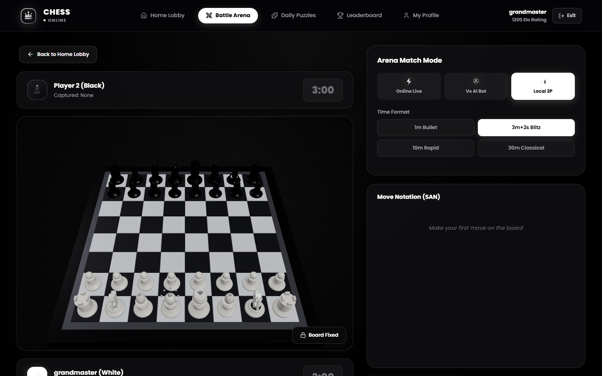
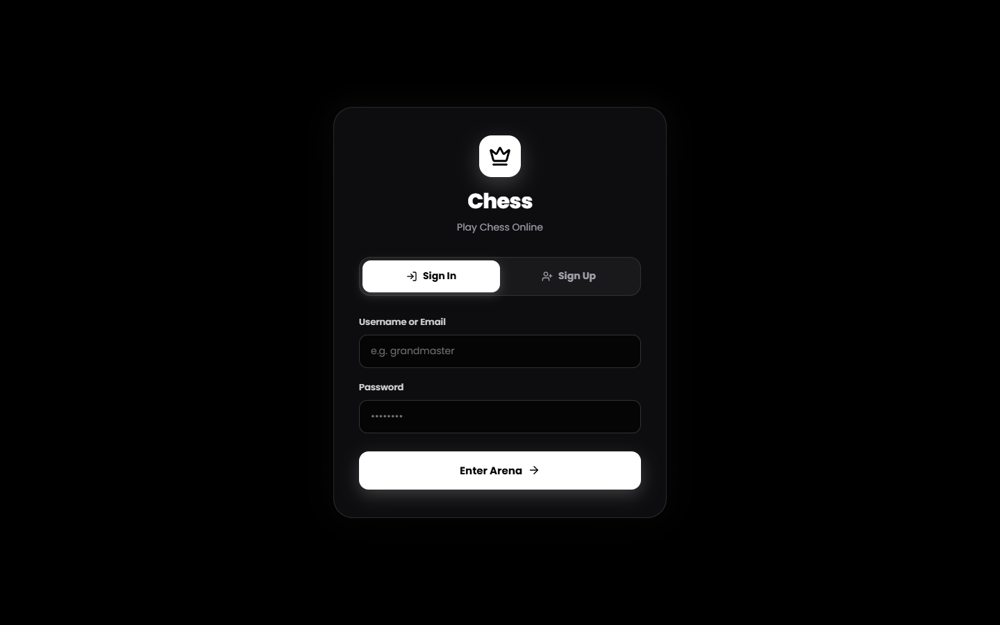
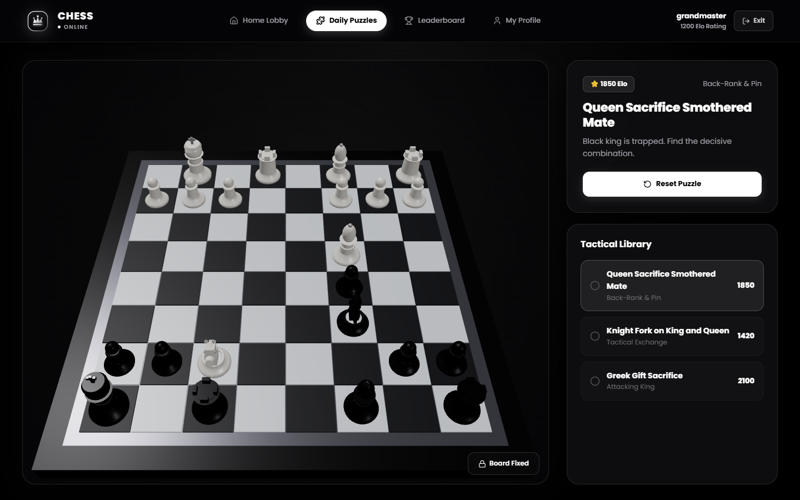
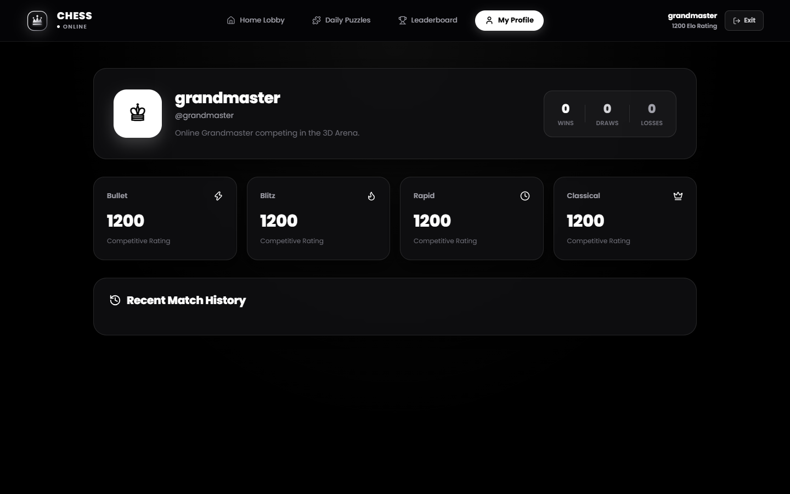
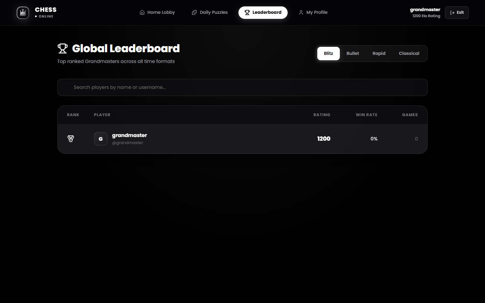
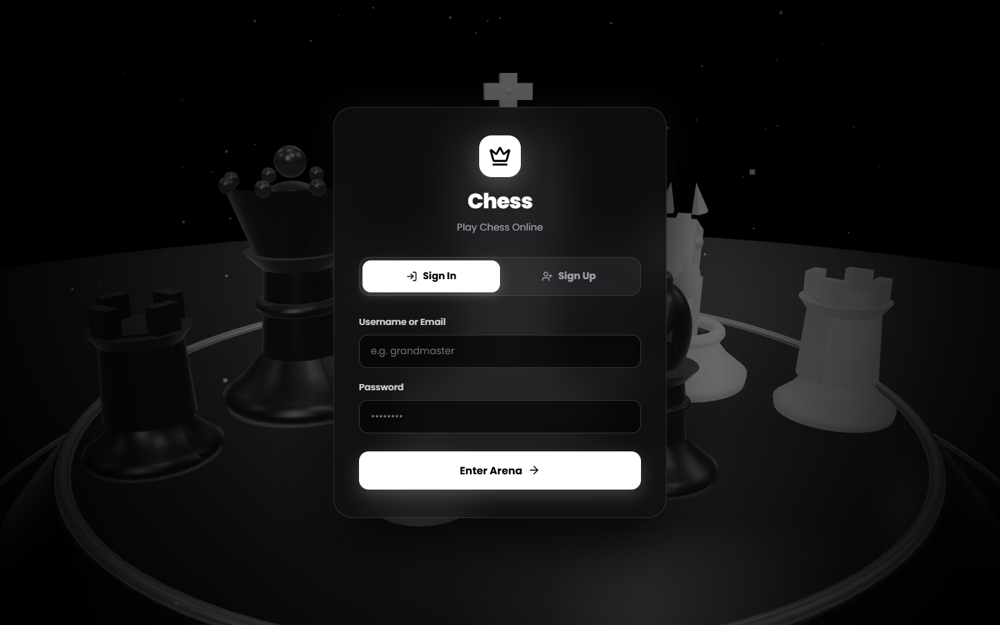

# ♟️ Grand Chess — Cinematic 3D Chess Arena

<p align="center">
  
</p>

<p align="center">
  <strong>A modern, cinematic 3D chess experience designed for the browser. Built with Three.js, React, and TypeScript.</strong>
</p>

<p align="center">
  
  
  
  
  
  
</p>

---

## 🌟 Overview

**Grand Chess** is an immersive, local-first 3D chess application combining the depth of traditional chess strategy with real-time 3D graphics, ambient sound effects, tactical puzzles, and responsive multiplayer matchmaking. 

Everything runs directly in your browser: no mandatory cloud databases, external servers, or third-party tracking required. Your profile, ratings, match histories, and puzzle progress are persisted locally with instant response times.

---

## ✨ Key Features

- **🎮 Full 3D Interactive Board**: Realistic 3D piece rendering, smooth lighting, piece lift animations, valid move highlights, and full orbit/zoom camera control.
- **🤖 Intelligent Chess Engine**: Play against an adaptive AI with three tailored difficulty levels (Novice, Intermediate, and Advanced).
- **⚡ Real-Time Multiplayer**:
  - **Quick Match & Custom Rooms**: Instant matchmaking with custom time controls (Bullet, Blitz, Rapid, Classical) and room codes.
  - **Tab & Device Pairing**: Synchronized peer gameplay over Server-Sent Events (SSE) and `BroadcastChannel`.
  - **Pass & Play**: Local hotseat mode on a single screen with automatic board rotation.
- **🧩 Tactical Puzzle Trainer**: Hand-crafted tactical puzzles (Smothered Mates, Knight Forks, Greek Gift Sacrifices) with interactive move validation and solve tracking.
- **📊 Competitive Leaderboard & Profiles**: Comprehensive player profile tracking games played, win/loss/draw ratios, dynamic Elo rating progressions, and game histories.
- **🎵 Atmospheric Sound Effects**: Clean audio feedback for piece moves, captures, checks, and game results.
- **📱 Responsive Luxury Dark UI**: Tailored typography, glassmorphic UI elements, and sleek monochrome aesthetics.

---

## 📸 Screenshots & Interface Tour

### 1. Main Lobby & Game Modes
Choose your preferred time format, challenge the engine, or enter the matchmaking queue.



---

### 2. 3D Battle Arena
Full 3D orbit camera, legal move rays, move notation history, active clock timers, and sound toggle.


---

### 3. Tactical Puzzles
Sharpen your pattern recognition with tactical challenges categorized by theme and rating.



---

### 4. Player Profile & Performance Metrics
View your rating breakdowns across Bullet, Blitz, Rapid, and Classical formats alongside match history.



---

### 5. Competitive Leaderboard
Track top-ranked players and compare your performance across all time controls.



---

### 6. Authentication & Player Identity
Seamless local account registration and instant profile switching.



---

## 🕹️ Controls & 3D Camera Navigation

| Action | Control |
|---|---|
| **Rotate / Orbit Camera** | Left-click + drag on the 3D board canvas |
| **Zoom In / Out** | Mouse scroll wheel or pinch gesture |
| **Select / Move Piece** | Left-click piece, then left-click target highlighted square |
| **Reset Camera Angle** | Click the camera reset button in the top HUD |
| **Toggle Audio** | Click the speaker icon in the arena header |

---

## 🏗️ Architecture & Tech Stack

```
chess/
├── apps/
│   └── admin/                  # Main web application
│       ├── src/
│       │   ├── api/            # Local-first persistence & SSE matchmaking client
│       │   ├── components/     # UI controls, HUD, and 3D Three.js canvas
│       │   │   └── 3d/         # Procedural 3D chess pieces & board shaders
│       │   ├── pages/          # Auth, Lobby, Arena, Puzzles, Leaderboard, Profile
│       │   ├── server/         # Vite matchmaking plugin (SSE & room manager)
│       │   ├── styles/         # Glassmorphism & luxury dark design system
│       │   └── utils/          # Procedural sound synthesis & audio effects
│       └── vite.config.ts      # Vite build and dev server config
├── docs/
│   └── screenshots/            # UI screenshots & showcase assets
├── packages/
│   ├── types/                  # Shared TypeScript types and contracts
│   └── config/                 # Monorepo shared tsconfig configurations
├── package.json                # Workspace scripts
└── pnpm-workspace.yaml         # Monorepo workspace configuration
```

### Core Technologies
- **Frontend Framework**: [React 18](https://react.dev/) + [TypeScript](https://www.typescriptlang.org/)
- **3D Graphics**: [Three.js](https://threejs.org/) for WebGL procedural geometry, lighting, materials, and camera orbits
- **Chess Logic**: [chess.js](https://github.com/jhlywa/chess.js) for move generation, check/checkmate detection, and FEN parsing
- **Build Tool**: [Vite](https://vitejs.dev/) with hot module reloading and fast production bundling
- **Persistence**: Local-first storage model via standard browser `localStorage` and `BroadcastChannel`
- **Package Management**: [pnpm](https://pnpm.io/) workspaces

---

## 🚀 Getting Started

### Prerequisites
- **Node.js**: `>= 20.0.0`
- **pnpm**: `>= 9.0.0`

If pnpm is not yet installed:
```bash
npm install -g pnpm
```

### Installation

1. **Clone the repository**:
   ```bash
   git clone https://github.com/anujcodess1/chess.git
   cd chess
   ```

2. **Install dependencies**:
   ```bash
   pnpm install
   ```

3. **Start the development server**:
   ```bash
   pnpm dev
   ```

4. Open your browser at **`http://localhost:5175`**.

---

## 💻 Available Scripts

| Command | Description |
|---|---|
| `pnpm dev` | Starts the Vite dev server with matchmaking plugin on port `5175` |
| `pnpm build` | Compiles the production bundle to `apps/admin/dist` |
| `pnpm preview` | Serves the production build locally |
| `pnpm typecheck` | Runs TypeScript type checking across all workspace packages |

---

## 🔒 Privacy & Local-First Philosophy

- **No Remote Database Dependency**: All user accounts, match history, and puzzle states remain on your device.
- **Zero Third-Party Tracking**: No telemetry, analytics, or external ad scripts.
- **Data Reset**: To completely wipe all local profiles and match histories, clear the site's local storage in your browser dev tools or use the in-app reset.

---

## 📄 License

This project is licensed under the **MIT License** — feel free to modify and build upon it.
